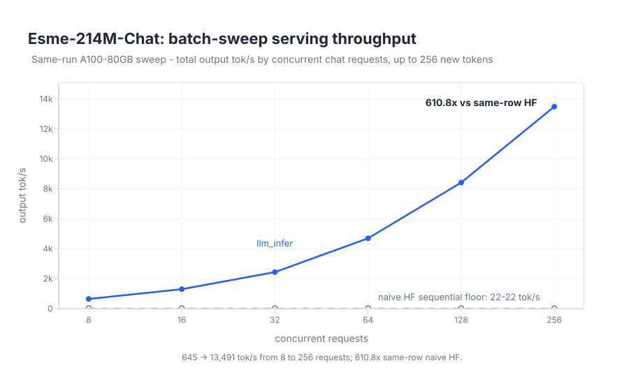

# llm-infer

`llm-infer` is a small Python inference engine for learning, research, and measurement. The
goal is to make real serving techniques easy to inspect, to check outputs before making speed
claims, and to state the limits. This is not a production server or an attempt to match mature inference
engines.

It owns the runtime path: model forward pass, paged KV cache, scheduler, sampler, serving
loop, benchmark harness, and trace output.

`Esme-214M-Chat` is the default model throughout the docs. Naive HuggingFace generation is
the external baseline speed is measured against; Qwen2.5-Coder is the independent HuggingFace
reference for catching correctness regressions.

The core rule: every speed claim must first match a known-good reference output on
the same prompt and model. Experimental paths stay labeled experimental until they pass that
check.

## What Is Here

- Esme export-bundle loading through the `esme` backend.
- Paged KV cache with block tables, lazy allocation, refcounts, copy-on-write, and lifecycle
  tracing.
- Continuous batching with chunked prefill, so long prompts do not fully block active decode
  work.
- Prefix caching for sibling prompts with shared prompt blocks.
- Prompt-lookup speculative decoding with a greedy verifier. It is off by default and makes no
  headline speed claim.
- Request preemption under KV pressure: free KV, keep generated tokens, then resume by
  recompute.
- OpenAI-compatible HTTP serving for Chat Completions, Completions, and a small stateless
  Responses subset.
- Prometheus-style metrics and a local KV trace visualizer.

For the longer architecture map, see [docs/architecture.md](docs/architecture.md).

## Backends

- `esme`: Esme export bundles, with `Esme-214M-Chat` as the headline path. Esme serves through
  real paged KV on the shared engine path and is checked for exact parity against the
  full-recompute `PretrainBundleModel.logits()` reference.
- `dense`: compatibility alias for the same internal bundle loader. Public docs and examples
  use `esme`.
- `qwen`: independent HF reference backend for
  `Qwen/Qwen2.5-Coder-3B-Instruct` at revision
  `488639f1ff808d1d3d0ba301aef8c11461451ec5`.

## Install

Python 3.11+ is required. Dependencies are managed with `uv`.

```bash
uv sync --extra dev --extra serving
uv run ruff check
uv run pytest tests/correctness -q
uv run pytest -q
```

The default checks are CPU-runnable. The slow 3B Qwen reference checks are opt-in:

```bash
uv run pytest tests/correctness -q -m slow
```

## Serve Locally

Start Esme from a local export bundle:

```bash
export ESME_BUNDLE_PATH=/path/to/esme-214m-chat
uv run python -m llm_infer.serve --backend esme --bundle "$ESME_BUNDLE_PATH" --open
```

The server exposes:

- `POST /v1/chat/completions`
- `POST /v1/completions`
- `POST /v1/responses`
- `GET /metrics`
- `/` for the small local chat UI

The official OpenAI Python client works by setting `base_url` to
`http://127.0.0.1:8000/v1`. The API key is ignored because this local server has no auth.

Engine knobs: `--block-size`, `--num-blocks`, `--decode-window-size` (decode steps per
EOS host sync; 1 restores the classic per-step path), `--prefill-chunk-size`,
`--preemption-policy`, and `--prompt-lookup-speculative`. See
`uv run python -m llm_infer.serve --help`.

## Benchmarks

A system reports tok/s only after its tokens match the fp32 `PretrainBundleModel.logits()`
reference, with traced numerical ties the only allowed difference.

Headline — `2026-07-02`, A100-80GB, **64 concurrent chat requests x up to 256 new
tokens** (a realistic small-service load, within Esme's 1024-token context), greedy,
median of 3 iterations:

| System | tok/s | vs naive baseline |
| --- | ---: | ---: |
| naive HF sequential | 34.6 | 1x |
| `llm_infer` | 930.4 | **26.9x** |

Throughput scales with concurrency because all requests decode through one shared paged-KV
engine, while the naive baseline stays flat:



Methodology and the committed curve record are summarized in
[docs/benchmark.md](docs/benchmark.md).

## KV Trace Visualizer

The static viewer in [visualizer/](visualizer/) replays schema-versioned JSONL traces emitted
by `InferenceEngine(trace=...)`. It can use the committed fixture or a real engine trace. See
[visualizer/README.md](visualizer/README.md).

## Where To Look

- [docs/scoping.md](docs/scoping.md) - scope, non-goals, and the reference-before-speed rule.
- [docs/architecture.md](docs/architecture.md) - runtime flows and module ownership.
- [docs/benchmark.md](docs/benchmark.md) - benchmark setup and current result record.
- [llm_infer/](llm_infer/) - engine code.
- [tests/correctness/](tests/correctness/) - reference and equivalence checks.
- [scripts/](scripts/) - goldens, loadgen, trace fixtures, and the figure generator.
- [assets/](assets/) - the committed curve record and rendered README figure.
- [visualizer/](visualizer/) - static trace replay UI.

## References

- Kwon et al., [_Efficient Memory Management for Large Language Model Serving with PagedAttention_](https://arxiv.org/abs/2309.06180), 2023.
- Yu et al., [_Orca: A Distributed Serving System for Transformer-Based Generative Models_](https://www.usenix.org/conference/osdi22/presentation/yu), 2022.
- Agrawal et al., [_Efficient LLM Inference via Chunked Prefills_](https://dl.acm.org/doi/10.1145/3759441.3759444), 2025.
- Leviathan et al., [_Fast Inference from Transformers via Speculative Decoding_](https://arxiv.org/abs/2211.17192), 2023.
- Dao, [_FlashAttention-2: Faster Attention with Better Parallelism and Work Partitioning_](https://arxiv.org/abs/2307.08691), 2023.
- OpenTelemetry, [_Traces_](https://opentelemetry.io/docs/concepts/signals/traces/).
