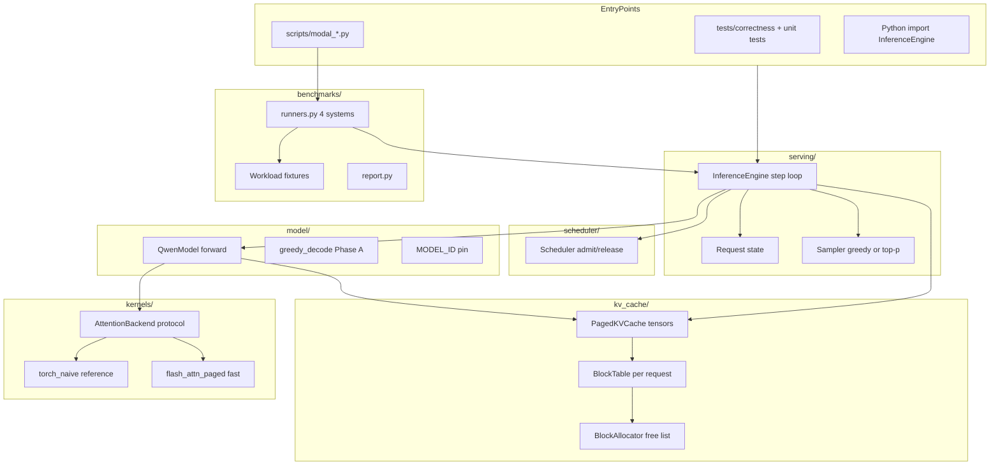
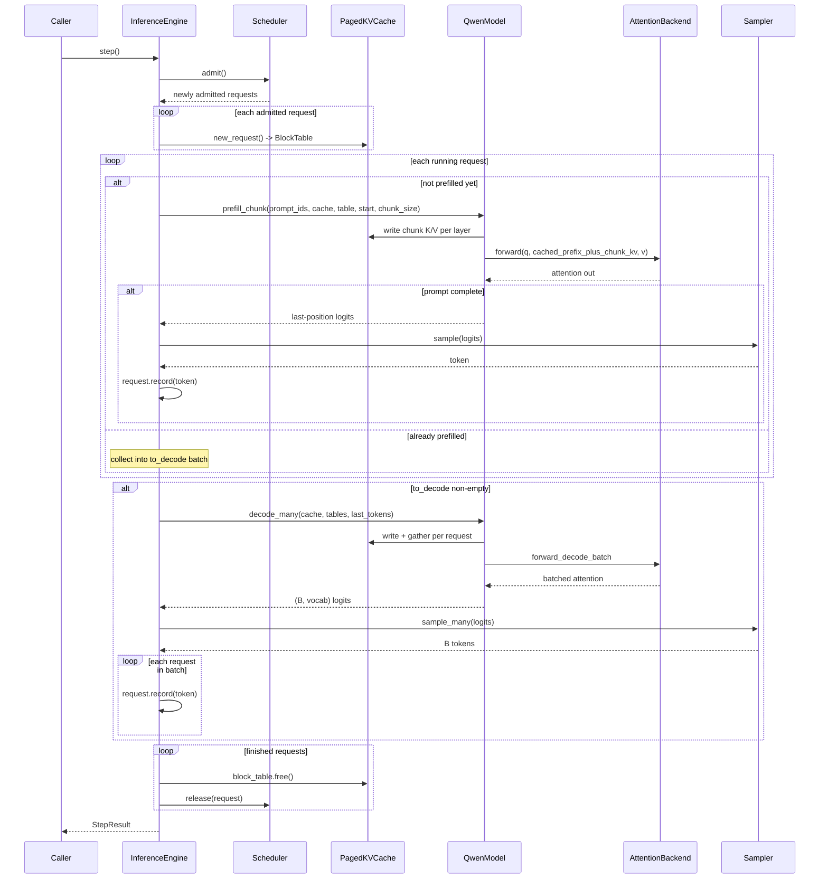
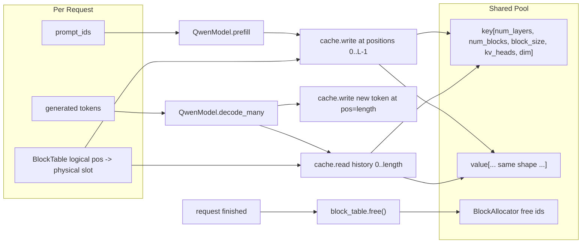
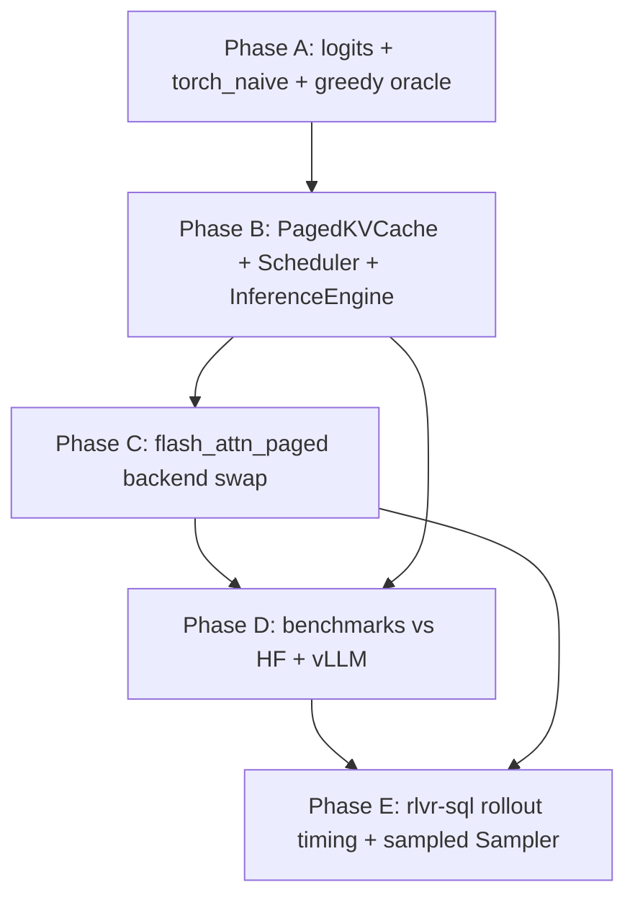

# llm-infer Architecture Guide

A concise, evidence-based map of how this repo works — what it owns, how modules connect,
and which flows actually exist in code.

## 1. Big Picture

**What this repo does.** [`README.md`](../README.md) and [`docs/scoping.md`](scoping.md) define
llm-infer as a minimal, honest **paged LLM inference engine** for one pinned model:
`Qwen/Qwen2.5-Coder-3B-Instruct`. It is built to be measured as an **rlvr-sql GRPO rollout
backend** — i.e., the GPU path that generates training rollouts for reinforcement learning on
text-to-SQL, not a general-purpose chat server.

**Main runtime type.** This is a **Python library + test/benchmark harness**, not a
long-running server. There is no HTTP API, no auth, and no database in this repo
([`docs/scoping.md`](scoping.md) explicitly lists OpenAI-compatible serving as out of v1 scope).
You drive inference by:

- importing `InferenceEngine` from [`llm_infer/serving/`](../llm_infer/serving/) in Python code
  or tests, or
- running **Modal GPU scripts** in [`scripts/`](../scripts/) (`modal_oracle.py`,
  `modal_benchmark.py`, `modal_rollout.py`).

There are **no `[project.scripts]` entry points** in [`pyproject.toml`](../pyproject.toml) — I
don't see evidence for a packaged CLI.

**Most important technologies and why.**

| Technology | Role | Why here |
|---|---|---|
| **PyTorch** | Forward pass, tensors, sampling | Core compute; custom Qwen forward in [`llm_infer/model/qwen.py`](../llm_infer/model/qwen.py) |
| **Transformers (HuggingFace)** | Load weights + config only | Weights come from HF; forward is ours so the oracle tests *our* engine |
| **flash-attn** (CUDA only) | Fast attention kernel | Phase C speed swap behind [`AttentionBackend`](../llm_infer/kernels/base.py); optional, GPU-only |
| **pytest** | Correctness oracle gate | Local CPU gate in [`tests/correctness/`](../tests/correctness/) |
| **Modal** | Remote A100 runs | flash-attn oracle, 3-way benchmark, rlvr-sql rollout timing ([`scripts/modal_*.py`](../scripts/)) |
| **uv** | Dependency management | [`pyproject.toml`](../pyproject.toml), Python 3.11+ |

**Design doctrine (the thing that shapes everything).** Correctness comes first: every
attention backend must pass the HF greedy oracle before it earns a tok/s number
([`docs/scoping.md`](scoping.md), [`AGENTS.md`](../AGENTS.md)).

---

## 2. Architecture Map

### Module ownership



| Module | Owns | Does NOT own |
|---|---|---|
| [`model/`](../llm_infer/model/) | Qwen2 forward (RoPE, GQA, RMSNorm, MLP), `logits` / `prefill` / `decode_one` / `decode_many` | Scheduling, block allocation, token sampling policy |
| [`kernels/`](../llm_infer/kernels/) | Causal scaled dot-product attention only (`softmax(QKᵀ/√d)V`) | RoPE, GQA expansion, paging — caller prepares tensors ([`base.py`](../llm_infer/kernels/base.py)) |
| [`kv_cache/`](../llm_infer/kv_cache/) | Physical K/V tensor pool, block ids, scatter/gather | Attention math, admission policy |
| [`scheduler/`](../llm_infer/scheduler/) | Waiting queue, running set, **block budget reservation** | Physical block allocation (lazy via `BlockTable.reserve`) |
| [`serving/`](../llm_infer/serving/) | Request lifecycle, step loop, sampler | Model weights, kernel choice (injected at `QwenModel.load`) |
| [`benchmarks/`](../llm_infer/benchmarks/) | Shared workload + timing wrappers for HF / llm-infer / vLLM | Engine correctness (gated by oracle first) |
| [`tests/correctness/`](../tests/correctness/) | HF golden fixtures + oracle tests | Production serving |
| [`scripts/`](../scripts/) | Modal images, GPU harnesses, golden generation | Core library logic |

### Dependency direction (inward)

**Outer → inner:** `scripts/` and `tests/` → `benchmarks/` / `serving/` → `scheduler/` +
`model/` → `kv_cache/` + `kernels/`.

**Key boundary:** [`AttentionBackend`](../llm_infer/kernels/base.py) is the swap point.
[`QwenModel`](../llm_infer/model/qwen.py) always gathers paged K/V and calls the backend;
swapping `TorchNaiveAttention` → `FlashAttnPagedAttention` does not touch scheduler or cache
code.

**Hidden coupling to know about:**

- RoPE positions are **per-request sequence length**, never batch row index — documented
  heavily in [`qwen.py`](../llm_infer/model/qwen.py) because getting this wrong silently
  breaks paged decode.
- Scheduler **reserves** worst-case blocks but **allocates lazily** — two layers that must
  stay consistent ([`scheduler.py`](../llm_infer/scheduler/scheduler.py),
  [`block_table.py`](../llm_infer/kv_cache/block_table.py)).
- rlvr-sql prompts are a **verbatim copy** in [`tests/correctness/prompt.py`](../tests/correctness/prompt.py),
  not an import — goldens freeze on exact bytes.

---

## 3. Key Flows

Only flows that exist in this repo.

### Flow A — Phase A greedy decode (correctness oracle path)

Used by [`greedy_decode`](../llm_infer/model/decode.py) and
[`test_greedy_oracle.py`](../tests/correctness/test_greedy_oracle.py). **No KV cache, no
batching.**

1. Load `QwenModel` with default `TorchNaiveAttention`, fp32 on CPU
   ([`QwenModel.load`](../llm_infer/model/qwen.py)).
2. Start from `prompt_ids`.
3. Each step: call `model.logits(full_sequence)` — full recompute over entire prefix.
4. Argmax last row → append token.
5. Stop on EOS or `max_new_tokens`.
6. Compare output to committed golden `continuation_ids` in
   [`tests/correctness/goldens/`](../tests/correctness/goldens/).

### Flow B — Continuous-batching engine step (Phase B+ core loop)

Implemented in [`InferenceEngine.step`](../llm_infer/serving/engine.py). This is the **main
production inference path** for multi-request work.

1. **Admit:** scheduler moves waiting → running if block budget fits
   ([`Scheduler.admit`](../llm_infer/scheduler/scheduler.py)).
2. For each running request without `prefilled`: cache one prompt chunk, bounded by
   `InferenceEngine(prefill_chunk_size=...)`. When the full prompt is cached, sampler picks
   the first token.
3. For all already-prefilled running requests: **one** `model.decode_many()` batched forward
   → `sampler.sample_many()`.
4. **Finish:** requests hitting EOS or length cap get `block_table.free()` and scheduler
   releases their budget.
5. Repeat until queue + running empty (`engine.run()`).

The vertical slice test in [`test_paged_decode.py`](../tests/correctness/test_paged_decode.py)
proves: admit 2 → decode → one finishes → third admitted → all correct.

### Flow C — Correctness gate (local + GPU)

**Local CPU (default gate):**

```bash
uv run pytest tests/correctness -q
```

- [`test_greedy_oracle.py`](../tests/correctness/test_greedy_oracle.py): Phase A
  full-recompute vs golden HF tokens.
- [`test_paged_decode.py`](../tests/correctness/test_paged_decode.py): cached/batched paths
  vs golden and vs each other.
- Goldens are **never re-run HF at test time** — frozen in JSON
  ([`docs/fixture-format.md`](fixture-format.md)).

**GPU flash backend:**

```bash
modal run scripts/modal_oracle.py --command oracle
```

Validates `FlashAttnPagedAttention` on A100 with tie-tolerance for bf16 numerical ties
([`docs/fixture-format.md`](fixture-format.md)).

### Flow D — Phase D three-way benchmark (Modal)

[`scripts/modal_benchmark.py`](../scripts/modal_benchmark.py) +
[`llm_infer/benchmarks/runners.py`](../llm_infer/benchmarks/runners.py):

1. Build shared [`Workload`](../llm_infer/benchmarks/workload.py) from golden prompt ids.
2. Run four decoders: `hf_sequential`, `hf_batched`, `llm_infer`, `vllm`.
3. **Adjudicate tokens** against fp32 reference (exact or traced tie).
4. Only correct systems get tok/s; print pinned config table ([`docs/benchmark.md`](benchmark.md)).

### Flow E — Phase E rlvr-sql rollout timing (Modal)

[`scripts/modal_rollout.py`](../scripts/modal_rollout.py):

1. Load merged grpo-s0 bf16 weights from Modal volume (produced by
   [`scripts/merge_adapter.py`](../scripts/merge_adapter.py)).
2. Replay frozen 32-completion GRPO batch from
   [`tests/fixtures/rollout_grpo_s0_spider_dev.json`](../tests/fixtures/rollout_grpo_s0_spider_dev.json).
3. `InferenceEngine` + `Sampler(temperature=1.0, top_p=1.0, seed=...)`.
4. Measure wall-clock, tok/s, $/1k rollouts vs vLLM ceiling and HF sequential floor.
5. **No cross-system token equivalence** under sampling (different RNG) — timing only.

**I don't see evidence for:** auth, database persistence, background job queues, app startup
lifecycle, or HTTP request handling.

---

## 4. Diagrams

### High-level architecture

See module diagram in §2.

### Sequence diagram — one `InferenceEngine.step`



### Data flow — paged KV cache



K/V stored **after RoPE, before GQA expansion**
([`paged_kv_cache.py`](../llm_infer/kv_cache/paged_kv_cache.py)).

### Dependency / phase diagram



All phases marked complete in [`README.md`](../README.md).

---

## 5. Important Concepts

**Paged KV cache.** Instead of one contiguous cache tensor per request, K/V lives in
fixed-size **blocks** shared across requests. Each request has a **block table** mapping
logical token positions to physical block slots
([`block_table.py`](../llm_infer/kv_cache/block_table.py)).

**Continuous batching (v1 scope).** At each decode-step boundary, finished requests leave the
batch and queued requests may enter ([`docs/scoping.md`](scoping.md)). No chunked prefill, no
mixed prefill/decode fusion in v1.

**AttentionBackend protocol.** Narrow interface: given already-RoPE'd, GQA-expanded Q/K/V
tensors, compute causal attention ([`kernels/base.py`](../llm_infer/kernels/base.py)).
`forward_decode_batch` fuses B single-token decodes with ragged histories.

**GQA (Grouped Query Attention).** Fewer KV heads than query heads; KV heads are repeated
before attention ([`_expand_kv`](../llm_infer/model/qwen.py)).

**RoPE (Rotary Position Embedding).** Position encoding applied per absolute token index;
critical that decode uses each request's own `table.length`, not batch index.

**Oracle / golden fixture.** Committed JSON of HF greedy token ids; tests replay without
calling HF ([`docs/fixture-format.md`](fixture-format.md)).

**Honesty bar / tie tolerance.** bf16 flash path may diverge on genuine logit ties; acceptable
only if traced to equal-within-tolerance logits — never "close enough."

**rlvr-sql / GRPO.** rlvr-sql is the parent RL text-to-SQL project; GRPO (Group Relative
Policy Optimization) needs many sampled completions per prompt. Phase E measures this rollout
pattern ([`docs/keeping-the-gpu-busy.md`](keeping-the-gpu-busy.md)).

**Naive HF baseline (`hf_sequential`).** Per-request `model.generate()`, one at a time — the
honest floor, not full recompute ([`runners.py`](../llm_infer/benchmarks/runners.py)).

**Surprising choices:**

- Custom forward with HF weights — oracle validates *our* stack, not HF's.
- `Sampler` at temperature 0 wraps argmax so greedy oracle and engine share one path
  ([`sampler.py`](../llm_infer/serving/sampler.py)).
- `torch_naive` intentionally loops in `forward_decode_batch` — correctness reference, not
  performance.

---

## 6. Where To Read Next

| Order | File | Question it answers |
|---|---|---|
| 1 | [`docs/scoping.md`](scoping.md) | What is in/out of scope? What is the v1 claim? |
| 2 | [`llm_infer/kernels/base.py`](../llm_infer/kernels/base.py) | What is the swappable boundary? |
| 3 | [`llm_infer/model/qwen.py`](../llm_infer/model/qwen.py) | How does the forward pass work (prefill vs decode vs full recompute)? |
| 4 | [`llm_infer/serving/engine.py`](../llm_infer/serving/engine.py) | How does continuous batching actually run step-by-step? |
| 5 | [`llm_infer/scheduler/scheduler.py`](../llm_infer/scheduler/scheduler.py) | When can a request enter/leave the batch? |
| 6 | [`llm_infer/kv_cache/paged_kv_cache.py`](../llm_infer/kv_cache/paged_kv_cache.py) + [`block_table.py`](../llm_infer/kv_cache/block_table.py) | How are K/V pages stored and addressed? |
| 7 | [`tests/correctness/test_paged_decode.py`](../tests/correctness/test_paged_decode.py) | What correctness properties must hold? |
| 8 | [`llm_infer/benchmarks/runners.py`](../llm_infer/benchmarks/runners.py) | How is llm-infer wired for benchmarking vs HF/vLLM? |
| 9 | [`docs/fixture-format.md`](fixture-format.md) | How are goldens structured and regenerated? |
| 10 | [`scripts/modal_rollout.py`](../scripts/modal_rollout.py) | How does Phase E connect to rlvr-sql economics? |

---

## 7. Accuracy Rules (applied)

- Every major claim above cites a file under `llm_infer/`, `tests/`, `docs/`, or `scripts/`.
- **No HTTP server, auth, or database** — not in scope; no code found.
- **No packaged CLI** — `pyproject.toml` has no scripts section.
- **v1 complete (Phases A–E)** per [`README.md`](../README.md) status table.
- Model pin: [`llm_infer/model/config.py`](../llm_infer/model/config.py) — Instruct variant only.

---

## 8. Final Summary

### The system in one paragraph

llm-infer is a correctness-first Python inference library for a single pinned
Qwen2.5-Coder-3B-Instruct model. It implements its own Qwen forward pass over HuggingFace
weights, stores KV cache in paged blocks, schedules multi-request continuous batching, and
delegates only the attention matmul to swappable backends (`torch_naive` for truth,
`flash-attn` for speed). An `InferenceEngine` step loop admits requests, prefills new ones,
fuses decode for all running requests via `decode_many`, samples tokens, and frees finished
blocks. Correctness is enforced by pytest oracles against committed HF greedy goldens before
any throughput claim; Modal scripts benchmark against naive HF and vLLM and measure rlvr-sql
GRPO rollout economics.

### The 5 things to understand first

1. **Oracle before speed** — no backend earns benchmarks until it matches HF greedy on the
   unit path ([`tests/correctness/`](../tests/correctness/)).
2. **`AttentionBackend` is the only kernel swap point** — paging and scheduling stay in the
   engine ([`kernels/base.py`](../llm_infer/kernels/base.py)).
3. **`InferenceEngine.step()` is the heart** — admit → prefill/decode_many → free
   ([`engine.py`](../llm_infer/serving/engine.py)).
4. **Two decode paths in `QwenModel`** — `logits` (Phase A truth) vs `prefill`/`decode_many`
   (Phase B+ cached) must agree ([`qwen.py`](../llm_infer/model/qwen.py)).
5. **This is a library + harness, not a server** — entry is tests, imports, or Modal scripts.

### Questions to ask next if you want to go deeper

- How would chunked prefill or prefix caching change the scheduler contract in
  [`scheduler.py`](../llm_infer/scheduler/scheduler.py)?
- What exactly triggers a traced numerical tie vs a real bug in the flash path
  ([`tests/correctness/tie_tolerance.py`](../tests/correctness/tie_tolerance.py))?
- Where is the biggest gap to vLLM — kernel, scheduler, or lack of CUDA graphs
  ([`docs/keeping-the-gpu-busy.md`](keeping-the-gpu-busy.md))?
- How do rollout fixtures differ from benchmark goldens
  ([`rollout_grpo_s0_spider_dev.json`](../tests/fixtures/rollout_grpo_s0_spider_dev.json) vs
  [`goldens/`](../tests/correctness/goldens/))?
- What would Phase F (OpenAI-compatible serving) require on top of
  [`InferenceEngine`](../llm_infer/serving/engine.py)?
