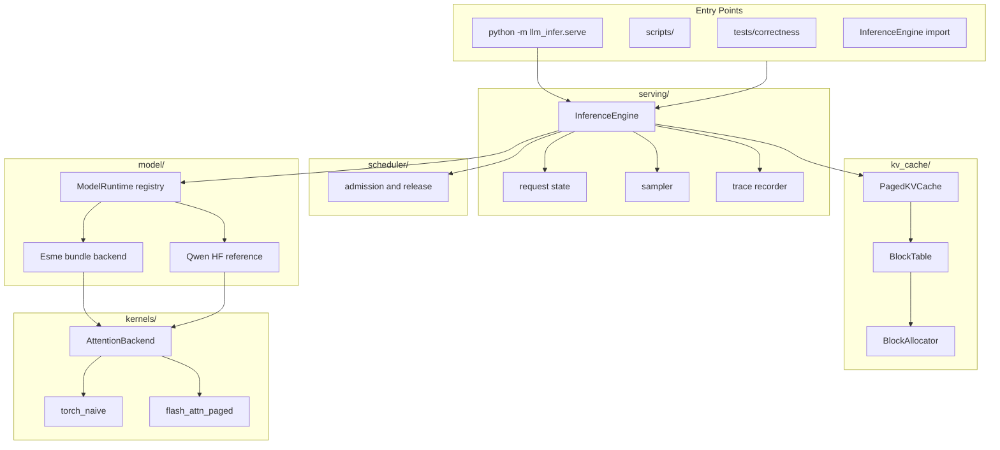

# Architecture

`llm-infer` is a Python inference library with an OpenAI-compatible HTTP server on top. The
primary path is Esme: `Esme-214M-Chat` loads from an export bundle, runs through the shared
paged-KV engine, and is checked against the full-recompute reference before speed is
reported.

## Runtime Map



## Module Ownership

| Module | Owns | Does not own |
| --- | --- | --- |
| [`model/`](../llm_infer/model/) | backend registry, capabilities, Esme bundle loader, Qwen HF reference backend | scheduling, block allocation, sampling policy |
| [`kernels/`](../llm_infer/kernels/) | causal attention implementations behind `AttentionBackend` | RoPE, GQA expansion, paging |
| [`kv_cache/`](../llm_infer/kv_cache/) | physical K/V tensor pool, block ids, scatter/gather | attention math, admission policy |
| [`scheduler/`](../llm_infer/scheduler/) | waiting queue, running set, block budget reservation | physical block allocation |
| [`serving/`](../llm_infer/serving/) | request lifecycle, engine step loop, sampler, server integration | model weights, backend choice |
| [`tracing.py`](../llm_infer/tracing.py) | schema-versioned engine events for JSONL replay | synthetic visualization state |
| [`benchmarks/`](../llm_infer/benchmarks/) | Esme and Qwen reference timing wrappers | reference correctness itself |

Dependency direction is intentionally simple:

```text
scripts/tests/server -> serving -> scheduler + model -> kv_cache + kernels
```

The main swap point is [`AttentionBackend`](../llm_infer/kernels/base.py). Model backends
prepare tensors, paging, RoPE positions, and GQA layout; attention backends compute attention.

## Engine Step

`InferenceEngine.step()` is the heart of the runtime:

1. Admit queued requests while the scheduler has block budget.
2. Prefill newly admitted requests, optionally in bounded chunks.
3. For already-prefilled requests, run one batched `decode_many()` forward.
4. Sample the next token for each row.
5. Finish requests that hit EOS or length caps, free their blocks, and admit more work on the
   next step.

The batch changes over time: finished requests leave, waiting requests enter, and long prompts
can prefill across several steps without fully blocking decode work.

For an all-greedy batch with no speculation, preemption, tracing, or prefix sharing, the
engine runs decode in **deferred windows** (`decode_window_size`, default 8; 1 restores the
per-step path): up to a window of decode steps runs per scheduler pass with sampled tokens
kept on device, EOS/stop decided at one host sync per window, and — on bundle backends —
per-step paging bookkeeping replaced by preallocated window buffers
(`llm_infer/model/decode_plan.py`). Outputs are token-for-token identical to the per-step
path; tokens become visible in window-sized bursts. See
[internal/esme-decode-overhead.md](internal/esme-decode-overhead.md) for the measurements.

## Paged KV Cache

K/V rows live in fixed-size physical blocks. Each request has a `BlockTable` mapping logical
token positions to physical slots. Prefix caching shares complete prompt blocks by refcount;
generation into a shared partial block uses copy-on-write.

K/V is stored after RoPE and before GQA expansion. Decode gathers each request's paged history,
packs the ragged batch, and passes it to the active `AttentionBackend`.

## Reference Contract

Esme speed rows are gated against direct bundle logits/generation. The full-recompute
`PretrainBundleModel.logits()` path is the reference; the paged prefill/decode path must agree
with it before throughput is reported.

Qwen is the independent HF reference for correctness tests, replaying frozen HuggingFace
full-recompute greedy fixtures.

bf16 can produce genuine near-ties. The project allows those only when they are traced as
within the documented tolerance; a non-tie divergence fails the reference gate.

## Serving Surface

`python -m llm_infer.serve` builds an app from an injected `ModelRuntime`. The app exposes:

- `/v1/chat/completions`
- `/v1/completions`
- `/v1/responses`
- `/metrics`

There is no auth layer or database in this repo. The server is a local serving surface for the
engine, not a production platform.

## Tracing

`InferenceEngine(trace=...)` emits schema-versioned JSONL events such as request admission,
prefill progress, decode steps, block allocation/free, preemption/resume, and request finish.
The static viewer in [../visualizer/](../visualizer/) replays those events without network
assets.

## Benchmarks

Current Esme measurements compare:

- naive HF sequential generation on the converted checkpoint,
- `llm_infer` on the Esme paged-KV path.

The repo's claim is narrow: a small, legible, reference-checked paged engine measured
against the naive baseline. See [benchmark.md](benchmark.md).

## Design References

| Technique | Role in this engine | Source |
| --- | --- | --- |
| Paged KV cache | Fixed-size blocks, per-request block tables, lower KV fragmentation, and KV sharing | PagedAttention (Kwon et al., 2023) |
| Continuous batching | Requests can enter and leave at decode-step boundaries | Orca |
| Chunked prefill | Long prompts are split so decode work can keep advancing | Agrawal et al., 2025 |
| Prefix caching | Shared prompt prefixes reuse cached K/V blocks | PagedAttention block sharing (Kwon et al., 2023) |
| Speculative decoding | Draft-and-verify shape for accepting multiple tokens safely | Leviathan et al. |
| FlashAttention-compatible backend | Fast exact attention behind a narrow kernel boundary | FlashAttention-2 |
| Trace events | Request/event observability vocabulary for replay and inspection | OpenTelemetry |

## Read Next

1. [scoping.md](scoping.md) - scope, non-goals, and the reference-before-speed rule.
2. [../llm_infer/serving/engine.py](../llm_infer/serving/engine.py) - the step loop.
3. [../llm_infer/model/pretrain_bundle.py](../llm_infer/model/pretrain_bundle.py) - Esme
   prefill/decode/full-recompute paths.
4. [../llm_infer/kv_cache/paged_kv_cache.py](../llm_infer/kv_cache/paged_kv_cache.py) - K/V
   storage and gather.
5. [benchmark.md](benchmark.md) - current measurement record.
